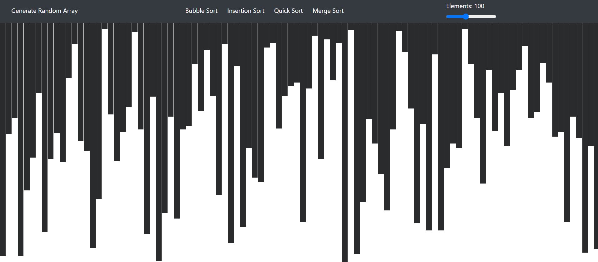
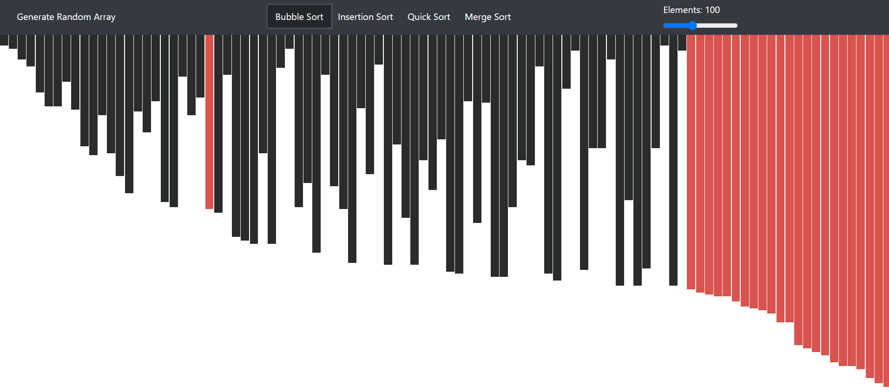

# Algorithm Visualizer
An application developed using ***ReactJS*** which helps visualize the various sorting algorithms.
---
---
## Sorting Algorithms: 

1) [x] **Bubble Sort**
2) [ ] **Insertion Sort** (To be implemented)
3) [ ] **Quick Sort** (To be implemented)
4) [ ] **Merge Sort** (To be implemented)
---
## Required Installations: 

1) [**Node.JS**](https://nodejs.org/en/)
2) **npm**
3) **create-react-app** 
```bash
    npm install -g create-react-app
```
4) **bootstrap**
```bash
    #in your node project folder!
    npm install bootstrap --save
```
5) **reactstrap**
```bash
    #in your node project folder!
    npm install reactstrap --save
```
---

## Using the Above Project!

1. Install Node.JS, npm and create-react-app
2. Clone the project.
3. Then go to the project folder and run:
```bash
    npm install
    npm start
```
---

## Screenshots

   | 


